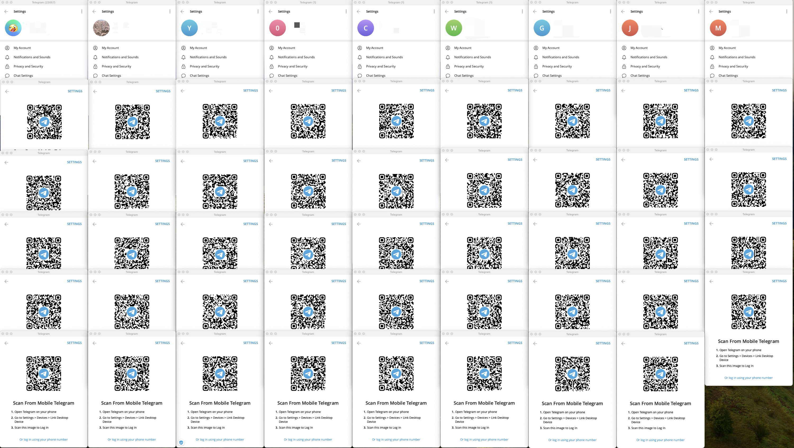

# 在 Mac 上多开 Telegram 教程

> 该教程只对 Mac Telegram 桌面版有效

## 实现原理

> 利用 Telegram 官方桌面版的 `-workdir` 指定工作目录来运行多个 Telegram 实例

## 预览图


## 创建单个 Telegram 分身（非必要步骤，批量创建脚本在下一节）

```shell
# Telegram 安装路径 -workdir 用户路径
nohup /Applications/Telegram.app/Contents/MacOS/Telegram -workdir /User/path > /dev/null 2>&1 &
```

注意：`/User/path` 指的是分身工作目录，需要提前建立好，并且有操作权限，建议建在家目录下。

### 使用教程

1. 下载 Telegram 桌面版并安装，默认安装路径 `/Applications/Telegram.app`，如果系统中存在多个 Telegram 版本，需要根据实际情况进行微调。
2. 打开 Mac 终端，快捷键 `command + 空格` 搜索终端。


3. 运行以下命令

```shell
# 建立分身数据存储文件夹（也可以起别的名字，随意）
mkdir telegram_clone

# 进入 telegram_clone
cd telegram_clone

# 创建子文件夹（也可以起别的名字，随意）
mkdir 100

# 创建 Telegram 分身，基础语法： `Telegram 安装路径` -workdir `用户路径`
nohup /Applications/Telegram.app/Contents/MacOS/Telegram -workdir /User/path/telegram_clone/100 > /dev/null 2>&1 &
```

## 批量创建和运行 Telegram 多个分身

> 批量脚本分为 2 个版本

### Tag 版本（telegram_clone_with_tag.sh）

> 适合需要创建很多分身的家人，例如 10 个以上

+ 优点：会对分身进行编号，可以很方便的区分每个分身
+ 缺点：会占用多余的硬盘空间，因为对分身编号需要将 Telegram 复制多份，为了美观，分身会统一存储在 `/Applications/TelegramClone` 路径中。


#### 使用教程

1. 下载 Telegram 桌面版，并安装，默认安装路径 `/Applications/Telegram.app`，如果有其他版本的 Telegram 占用了该路径，先卸载避免产生冲突。安装完桌面版后，可以再安装其他版本的 TG。
2. 打开 Mac 终端，运行以下命令。

```shell
# 下载批量脚本
git cloen https://github.com/11001100111011101110001/Mac_Telegram_Clone.git

# 进入脚本目录
cd Mac_Telegram_Clone

# 赋予执行权限，with_tag 脚本会对分身进行编号，without_tag 不会
chmod +x telegram_clone_with_tag.sh

# 创建/运行分身，--start 是开始编号，--end 是结束编号，--tag_num 是创建/运行指定编号分身
./telegram_clone_with_tag.sh --start 1 --end 10 # 创建/运行编号为 1-10 的 TG 分身
./telegram_clone_with_tag.sh --tag_num 10 15 18 # 创建/运行编号为 10 15 18 的 TG 分身
```

### 无 Tag 版本（telegram_clone_without_tag.sh）

> 适合无需创建太多分身和无需对分身进行编号管理的家人

+ 优点：清爽，不会占用多余的硬盘空间。
+ 缺点：无法对分身进行编号，大家都长一样，分身多了之后容易分不清。

#### 使用教程

```shell
# 下载批量脚本
git cloen https://github.com/11001100111011101110001/Mac_Telegram_Clone.git

# 进入脚本目录
cd Mac_Telegram_Clone

# 赋予执行权限，with_tag 脚本会对分身进行显性编号；without_tag 不会，需要家人自己记录对应关系。
chmod +x telegram_clone_without_tag.sh

# 创建/运行分身，第一个参数代表开始编号，第二个参数代表结束编号
./telegram_clone_xxxxx.sh 1 10 # 创建/运行编号为 1-10 的 TG 分身
```

## 关于升级

> 如果使用的是不带 Tag 的脚本创建的分身，只需要升级主程序即可。如果是带 Tag 的脚本创建的分身，升级了主程序后，将 `/Applications/TelegramClone` 路径下的分身全部删除，重新运行创建分身软件即可。

## 版本信息

+ Macbook Pro：M3 Max；64GB 内存
+ Telegram 桌面版：
  + 版本号：5.3.0
  + 下载地址：https://desktop.telegram.org/

## 据不严谨测试

M3 Max 64 GB 的 Mac 笔记本，可以同时运行 54 个 Telegram 分身，也就是说可以同时运行 54 * 3 = 162 个账号，多了之后新建立的分身会出现画面崩溃的情况，其他机型请自行测试。

## 参考资料

+ https://gist.github.com/AleksandrMihhailov/672d4f7ce3321ff2e2994d35117bd316
+ https://github.com/telegramdesktop/tdesktop/blob/dev/Telegram/SourceFiles/platform/mac/launcher_mac.mm